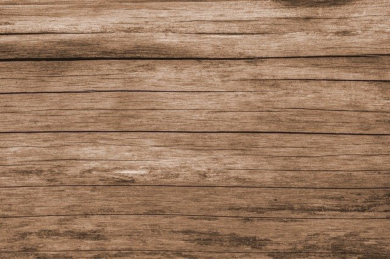
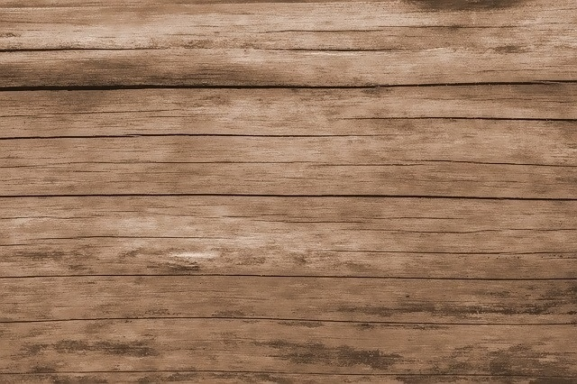

# OpenCV Training Bilateral Image Filtering

An introduction to bilateral image filtering using OpenCV.

## Contents :
This technique applies the filter selectively to blur similar intensity pixels in a neighborhood. Sharp edges are preserved, wherever possible.

| Function        |Action                                                                        |
|----------------:|------------------------------------------------------------------------------|
|cv2.bilateralFilter()   |We apply the filter, that accepts 3 arguments:|
|**src**          | Source image|
|**sigmaColor**       | Defines the spatial extent of the kernel, in both the x and y directions|
|**sigmaSpace**       |Defines the one-dimensional Gaussian distribution.|

## Test Image used: 
I have used test.jpg & bilateral_filtering.jpg that can be found in the repository.




## Summary:

```python
#Read image
image = cv2.imread('test.jpg')
```
```python
bilateral_filter = cv2.bilateralFilter(src=image, d=10, sigmaColor=55, sigmaSpace=55)
```

